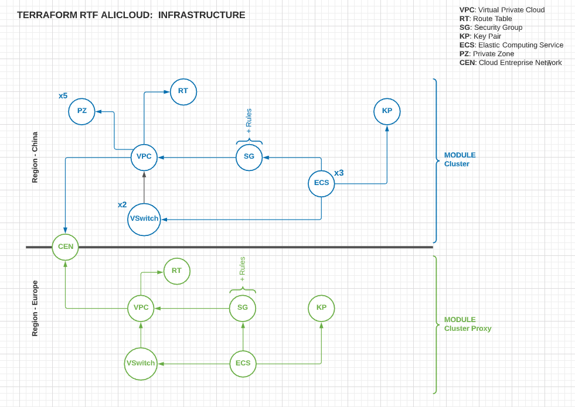

# RUNTIME FABRIC TERRAFORM PROJECT

This project aims to provide a configurable tool to install runtime fabric into alibaba cloud.

## ANATOMY

Deployment to alicloud in Mainland China is trickier than in other regions like Europe due to the Great Firewall of China. Likely, Alicloud provides some tools to overcomes this by connecting your cluster inside Mainland China to a proxy outside and route the traffic to that proxy. 

So, in order to support these different requirements, the scripts were designed to create 2 modules: 
* RTF Cluster: which is our actual Runtime Fabric Cluster (Blue Part)
* RTF Cluster Proxy: a formation that aims to optimize the traffic in case of a deployment in Mainland China (Green)



In order to setup the whole infrastructure, the Green module should come before the Blue module.

It is also possible to only install the Blue module.

## INSTALL 

Make sure to install alibaba cloud CLI. [link](https://partners-intl.aliyun.com/help/doc-detail/139508.htm).

Make sure to install terraform. [link](https://learn.hashicorp.com/tutorials/terraform/install-cli).


## ENCODE MULE LICENSE KEY

To install Runtime Fabric, your Mule license key must be Base64 encoded. Locate your organization’s Mule Enterprise license key file (license.lic) and perform the following according to your operating system.

#### Linux
To encode your license file on Linux, run the following:
```bash
base64 -w0 license.lic
```

#### MacOS
To encode your license file on MacOS, run the following from the terminal:
```bash
base64 -b0 license.lic
```

#### Windows
To encode your license file on Windows, a shell terminal emulator (such as cygwin) or access to a Unix-based computer is required to follow these steps:

1. Find your organization’s Mule Enterprise license key file (license.lic) and transfer to your Unix environment if necessary.
1. Run the following command to Base64 encode the license key:

```bash
base64 -w0 license.lic
```

## Run

#### List of Parameters

| Name                | Description           | Example   |
| --------------------|:----------------------|-----------|
| activation_data     | The encoded Runtime Fabric activation data. You can access this data by viewing your Runtime Fabric in Runtime Manager. | NzdlMzU1YTktMzAxMC00ODdxxxx |
| key_pair            | The name of the keypair that is going to be created in the Alicloud region you are deploying to.|   my-keypair |
| public_key          | The public key that will be stored. You should create a key pair localy using `ssh-keygen -t rsa -b 4096` and use the public here.|    ssh-rsa AAAAB3NzaC1yc2EAAAADAQABAAACAQCiMk7m user@example.com|
| enable_public_ips   | specifies whether the installer creates public IP addresses for each VM. Public IPs enable you to ssh directly to the VMs from your network. If this value is set to false(default) each VM only has access to the private network configured by its VPC. If you specify false, ensure you have consulted with your network administrator on how to obtain shell/SSH access to VMs.| true |
| controllers         | the number of controller VMs to provision.|  1 |
| workers             | the number of worker VMs to provision.    |  2 |
| mule_license        | the base64 encoded contents of your organization’s Mule Enterprise license key (license.lic).| |
| access_key_id       | The Access Key Id for alicloud CLI        | XXXXXXXX |
| access_key_secret   | The Access Key Secret for alicloud CLI    | XXXXXXXX |
| cluster_region      | The alibaba region where RTF cluster will be created you can checkout the links below this page for the complete list of alibaba regions. | cn-shanghai |
| cluster_proxy_region| If you are deploying the cluster in Mainland China (for example cn-shanghai) you will need a proxy outside of Mainland China in order to optimize your traffic. This represents the region where the proxy will be created. Please refer to the section where the 2 different architectures are explained| eu-central-1 |
| 


>**IMPORTANT** You will find an example file `example.tfvars.json` containing a template of the most important parameters you can use.

#### Script helpers

The project comes with a **bin** folder that contains some `bash` scripts:
* plan.sh: executes terraform plan 
* apply.sh: executes terraform apply
* destroy.sh: executes terraform apply

We highly encourage using them because they integrate important parameters like `-state` and `-out` while keeping a consitent location of the state accross different actions.

In order to use the these script you need at least to provide the location of the parameter file (see parameter section). You can also specify which module to evaluate, that way we can navigate between the actual cluster and the proxy.

#### Steps

1. Navigate to the project root directory. You must run Terraform from this directory.
2. Initialize Terraform
    ```bash
    $ terraform init
    ```
3. Copy `example.tfvar.json` to another file. We will refer to it as `params.tfvar.json`.
4. Fill `params.tfvar.json` using the data in the parameters table above. 
5. Make the bin scripts executable using:
    ```bash
    $ chmod +x bin/*
    ```
5. Deploy your infrastructure depending on your type of formation:
   1. Simple Mode: without proxy
      * deploy the cluster using the command:
         ```bash
         $ ./bin/apply.sh /path/to/params.tfvar.json module.rtf_cluster
         ```
   2. Full Mode: With proxy
      1. deploy the cluster proxy module first using:
         ```bash
         $ ./bin/apply.sh /path/to/params.tfvar.json module.rtf_cluster_proxy
         ```
      2. deploy the rest of the formation:
         ```bash
         $ ./bin/apply.sh /path/to/params.tfvar.json
         ```
         **Note** that we didn't add the third parameter on purpose in order to allow terraform to process the full formation and evaluate the existing proxy formation to retrieve the IP addresses...


## COMMON ERRORS

Sometimes the deployment takes a little bit of time to create all the stack and some elements take more time than others which can provoke a timeout kind of error that makes the deployment fail. 

**Resource not ready**
```bash
Error: [ERROR] terraform-provider-alicloud/alicloud/resource_alicloud_instance.go:428: Resource alicloud_instance RunInstances Failed!!! [SDK alibaba-cloud-sdk-go ERROR]:
SDK.ServerError
ErrorCode: IncorrectVSwitchStatus
Recommend: https://error-center.aliyun.com/status/search?Keyword=IncorrectVSwitchStatus&source=PopGw
RequestId: EE42C3F4-F222-4E3C-A9DC-76F644031264
Message: The current status of vSwitch does not support this operation.
```
```bash
ErrorCode: IncorrectStatus.cbnStatus
Recommend: https://error-center.aliyun.com/status/search?Keyword=IncorrectStatus.cbnStatus&source=PopGw
RequestId: 7FBF738E-C773-42FA-B7CC-38E26D885255
Message: Current CBN status does not support this operation.
```

This is provoked by the fact that the resource is not completely ready and its status is not the one terraform is hoping for. 

In order to correct that, just re execute the apply or destroy (depending on what you were performing) once again. Terraform will automatically detect that you already have some elements of the stack and will react accordingly.

**OperationConflict**
```bash
ErrorCode: OperationConflict
Recommend: https://error-center.aliyun.com/status/search?Keyword=OperationConflict&source=PopGw
RequestId: CF02F11B-6CFA-40D6-8CF8-CC47C1F5EFF3
Message: The operation against this instance is too frequent, please try again later.
```

This is provoked by the fact that terraform is performing operation too quickly for alicloud to absorb so it fails. This happens usually when you try to destroy your terraform formation. Just re-run the command in this situation, Terraform is smart enough to pick it up where it left.  


## Links

- List of Alibaba regions (codes): [link](https://www.alibabacloud.com/help/doc-detail/40654.htm)
- List of Alibaba Zones (codes): [link](https://www.alibabacloud.com/help/doc-detail/89155.htm)
- Runtime Fabric install guide for AWS: [link](https://docs.mulesoft.com/runtime-fabric/latest/install-aws)
- Product Comparison AWS vs Alibaba: [link](http://docs-aliyun.cn-hangzhou.oss.aliyun-inc.com/pdf/comparison-AlicloudlvsAWS-intl-en-2018-03-26.pdf)
